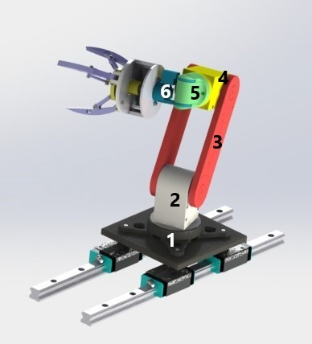
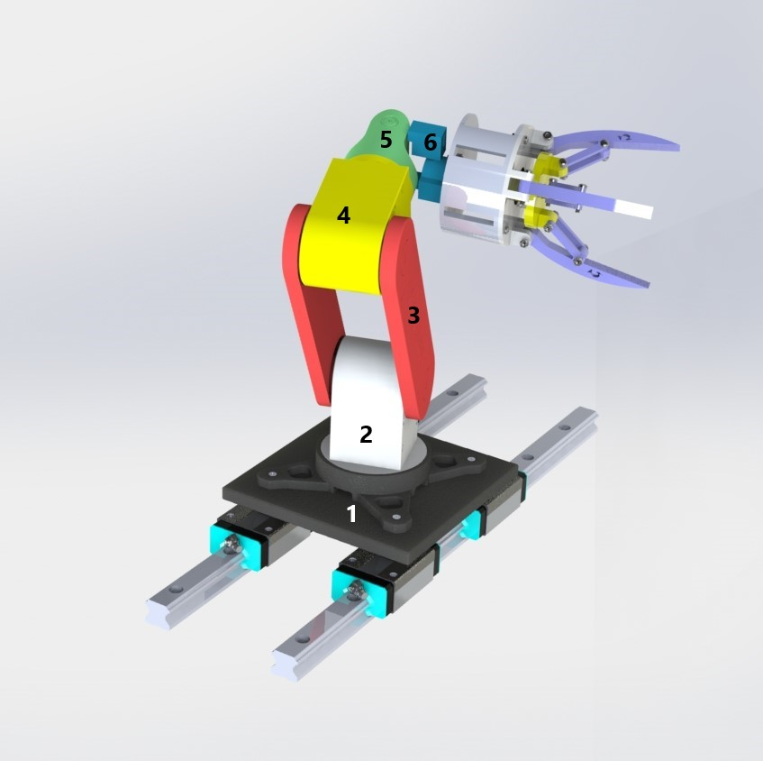
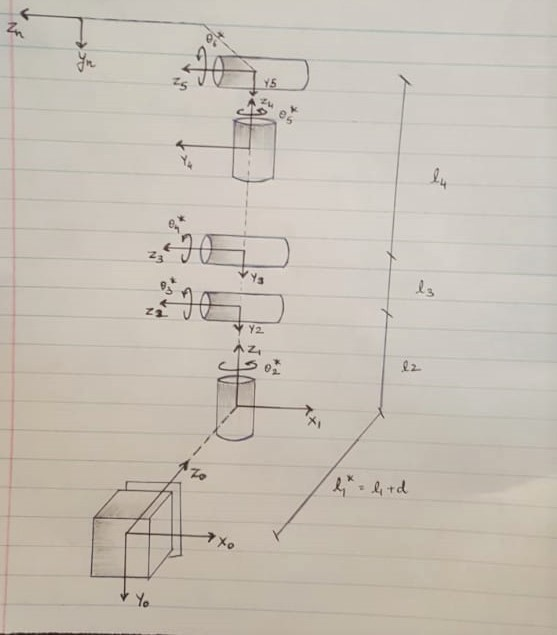
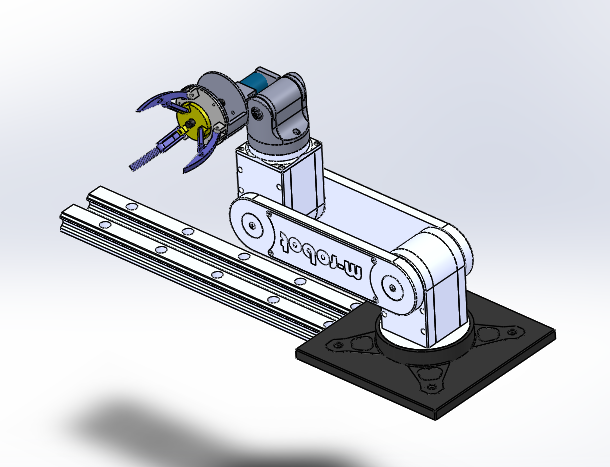
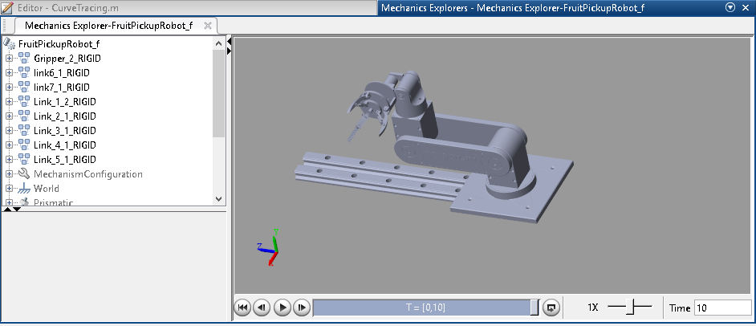
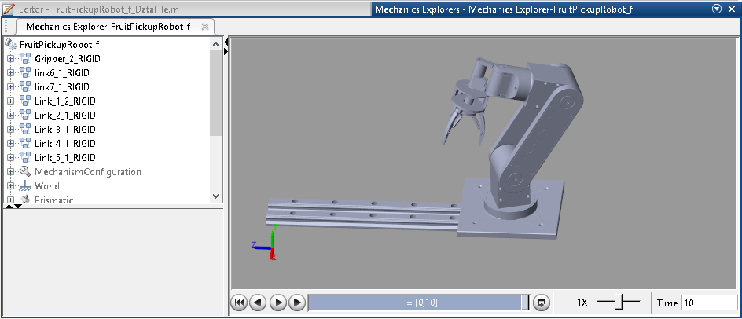

# Fruit-Picking-Robot

Introduction

The 3 basic needs of human beings are food, shelter and clothing. Parallel, the world population is
also growing at a very steep rate. Hence, natural resources such as land and water is always under continuous
stress. Moreover, due to deforestation and global warming cultivable land is decreasing. It is estimated that
in next 30 years we will have half the cultivable land which we have today. To make a nation healthy and
to meet food demands along with the right nutrition and security, agriculture would continue to remain
as the top priority sector for any country. To enhance the effciency of the supply chain going inline with
the demands of any nation, it is necessary to have effective solutions to iterative tasks like fruit picking,
ploughing, sowing etc.
Hence innovation in the agricultural yield will result in great impact on mankind and economy.
Articulated robots for fruit picking is a technology that enables autonomy in agriculture processes. As a
robotics engineer, I feel it is my moral responsibility to automate arduous jobs done by farmers and increase
yield. Hence, this is my motivation to choose the following robot as my modelling project.

# Robot Image

Isometric view 1

Isometric view 2

Links are represented with different colours for easy recognation.

# DH Table

DH table of Robot.

Iniital position while animation with simmechanics.

# Steps of working this project.

## PRE-REQUISITES: PC , Matlab , Solid Works

Step 1 : Download the attached zip file.

Step 2 : Open SW model parts and open assembly (Parts can be used and edited)(Folder : SW
Model)

Step 3 : Run the model and see Forward Kinamatics. Here you can See Parameter values which
can be changed to try different results.(Folder : Matlab code/Forward Kinematics.m)

Step 4 : Now after fowrard Kinamatics for validation copy the T matrix as input to inverse kine-
matics and check to output.(Validation purpose)(Folder : Matlab code/Inverse Kinematics.m)

Step 5 : Open Curve tracing file to see line diagram tracing the curve.(Folder : Matlab code/CurveTracing.m)

Step 6 : Run simulink model (Folder : simulink /FruitPickupRobotf.slx)

Step 7 : Change values of joint variable and make your own curve to run the robot.(change values
inside the FruitPickupRobotfDatafile.m)

Step 8 : Finally we can see video of the output for getting feel of the project.(Folder : Video)

Note:- If changes made in model will need to make an .xml file again and recompute simulation.
Any thing else change will result in no issue in the functionality.

## Image of robot in simscape environment.

Initial position

Final position

## Note for details of Modelling, Designing, Inverse Kinematics and Forward Kinematics of Fruit Picking Robot refer report and matlab files.
